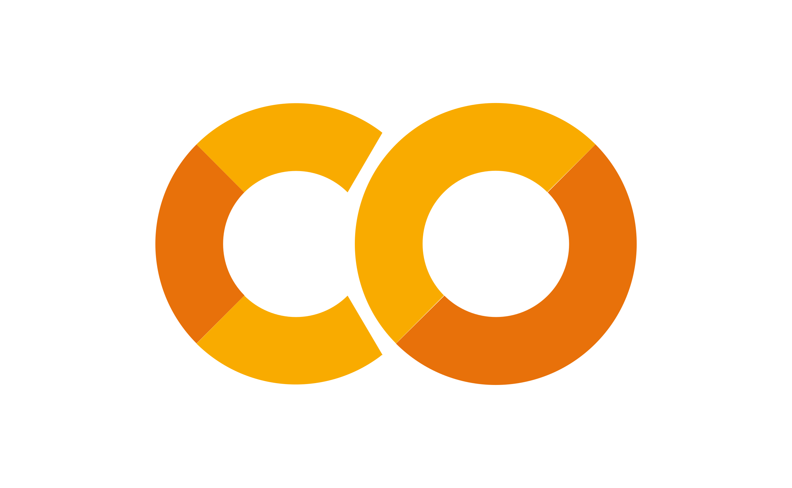

[![Contributors][contributors-shield]][contributors-url]
[![Forks][forks-shield]][forks-url]
[![Stargazers][stars-shield]][stars-url]
[![Issues][issues-shield]][issues-url]
[![MIT License][license-shield]][license-url]
[![LinkedIn][linkedin-shield]][linkedin-url]

 

  
  <h3 align="center">colab-rl</h3>
  

    Keras implementation of the latest Reinforcement Learning algorithms, ready to use in Google Colab.
     
    
     
     
    
    ·
    
  

  
Summary

  <ol>
    <li>
      <a href="#about-the-project">About the Project</a>
      <ul>
        <li><a href="#features">Features</a></li>
      </ul>
    </li>
    <li><a href="#notebook-examples">Notebook Examples</a></li>
    <li><a href="#estrutura-do-projeto">Estrutura do projeto</a></li>
    <li><a href="#contributing">Contributing</a></li>
    <li><a href="#to-do">To do</a></li>
    <li><a href="#license">License</a></li>
  </ol>

## About the Project

The Keras RL Algorithms for Google Colab project aims to provide a comprehensive implementation of state-of-the-art reinforcement learning algorithms using the Keras library. These algorithms enable researchers and practitioners to train and evaluate reinforcement learning agents for a wide range of applications.

(<a href="#readme-top">back to top</a>)

## Features

The project offers the following features:

- Implemented Algorithms: The repository includes implementations of popular reinforcement learning algorithms such as Deep Q-Networks (DQN), Proximal Policy Optimization (PPO), and Advantage Actor-Critic (A2C).
- Google Colab Ready: The algorithms are ready to use in Google Colab notebooks, making it convenient for users to experiment and train reinforcement learning models using cloud resources.
- Customizable and Extensible: The code is designed to be easily customizable and extensible, allowing users to modify the algorithms and adapt them to their specific tasks.

(<a href="#readme-top">back to top</a>)

## Notebook Examples

The repository provides the following notebook examples:

- DQN on CartPole: This notebook demonstrates how to train a Deep Q-Network (DQN) agent to play the CartPole game using Keras and Gym.
- PPO on LunarLander: In this notebook, we apply Proximal Policy Optimization (PPO) to solve the LunarLander environment, a continuous control task in OpenAI Gym.
- A2C on Breakout: This notebook showcases the Advantage Actor-Critic (A2C) algorithm applied to the classic Atari game Breakout, demonstrating how to learn an agent to play the game using raw pixel inputs.

(<a href="#readme-top">back to top</a>)

## Contributing

Contributions to the Keras RL Algorithms for Google Colab project are welcome! If you'd like to add new algorithms, improve existing implementations, or contribute in any other way, please follow these steps:

- Fork the repository.
- Create a new branch: git checkout -b my-branch.
- Make your changes and commit them: git commit -m 'Add some feature'.
- Push the changes to your fork: git push origin my-branch.
- Open a pull request and describe the changes you've made.

(<a href="#readme-top">back to top</a>)

## To do

- [ ] Improve the "Notebook Examples" sections on the readme.md
- [ ] Review all notebooks to see if they currently working

(<a href="#readme-top">back to top</a>)

## License
This project is licensed under the  [MIT License](/LICENSE).

(<a href="#readme-top">back to top</a>)

[contributors-shield]: https://img.shields.io/github/contributors/voaneves/colab-rl.svg?style=for-the-badge
[contributors-url]: https://github.com/voaneves/colab-rl/graphs/contributors
[forks-shield]: https://img.shields.io/github/forks/voaneves/colab-rl.svg?style=for-the-badge
[forks-url]: https://github.com/voaneves/colab-rl/network/members
[stars-shield]: https://img.shields.io/github/stars/voaneves/colab-rl.svg?style=for-the-badge
[stars-url]: https://github.com/voaneves.com/colab-rl/stargazers
[issues-shield]: https://img.shields.io/github/issues/voaneves/colab-rl.svg?style=for-the-badge
[issues-url]: https://github.com/voaneves/colab-rl/issues
[license-shield]: https://img.shields.io/github/license/voaneves/colab-rl.svg?style=for-the-badge
[license-url]: https://github.com/voaneves/colab-rl/blob/master/LICENSE.txt
[linkedin-shield]: https://img.shields.io/badge/-LinkedIn-black.svg?style=for-the-badge&logo=linkedin&colorB=555
[linkedin-url]: https://linkedin.com/in/voaneves
